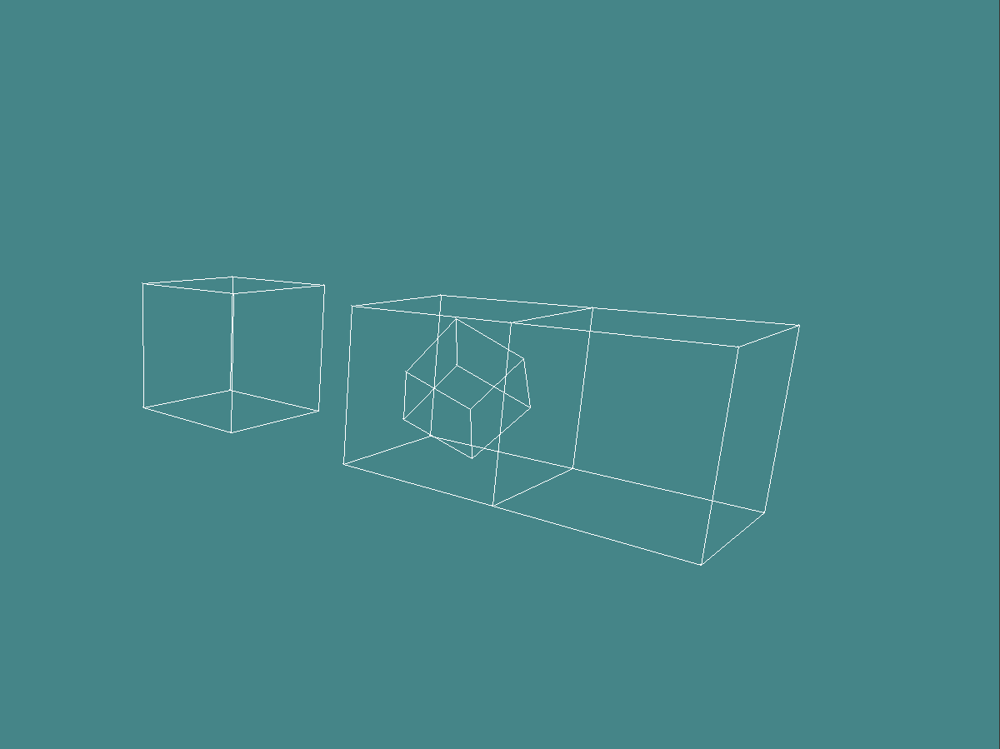

# 3D "rendering" in C



## Overview
A small 3D "engine" to learn a bit of C. SDL2 is used to draw the screen. The perspective calculations are not quite correct. The game is written in a pseudo object oriented way, as that's what I'm most familiar with. Future C projects will adhere to a more classical C style.

## Installation
Dependencies:
```
sudo apt install libsdl2-dev
```
Clone repo and build the game:
```
git clone https://github.com/LennardMarx/RenderingInC.git
cd RenderingInC
chmod +x build.sh
./build.sh
```
Run with:
```
./bin/game
```

## Controls
W,A,S,D - move\
Q,E - turn on vertical axis\
Up, Down - turn on frontal axis\
Left, Right - turn on sagittal axis
Esc - quit game
